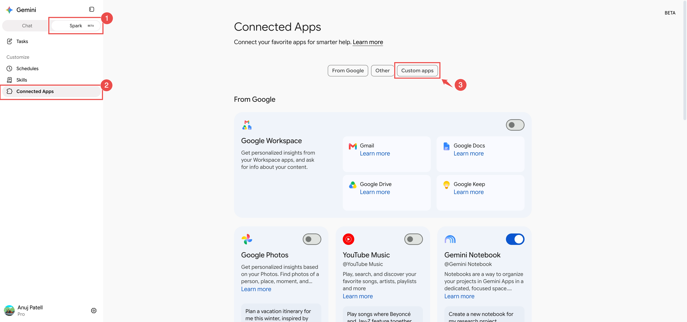
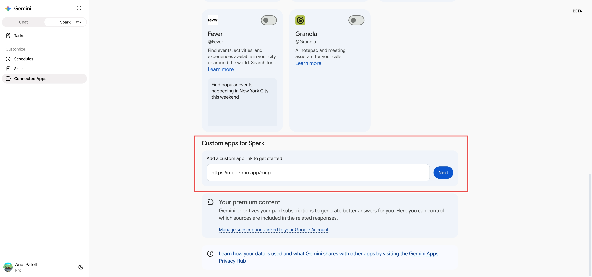
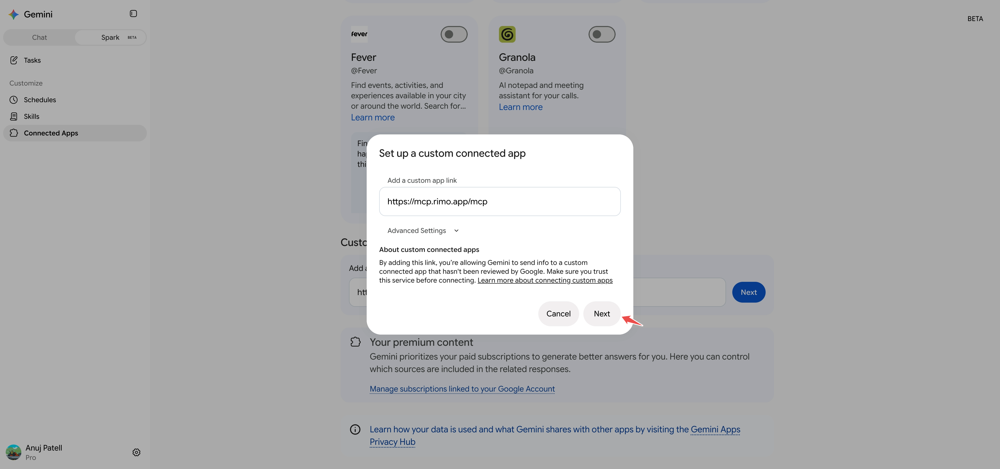
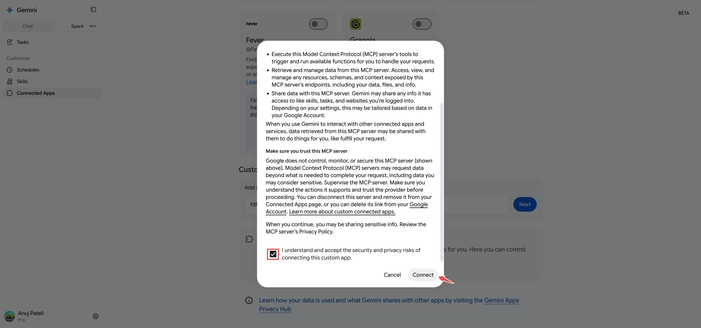
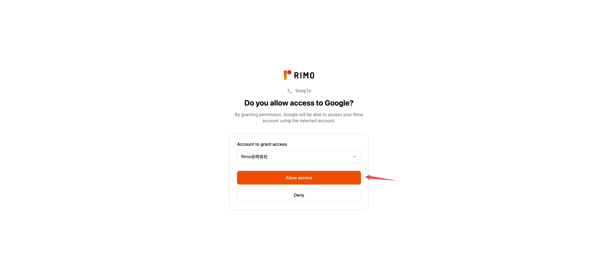
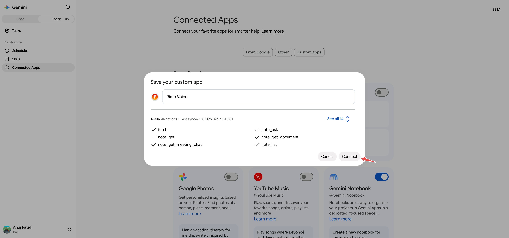
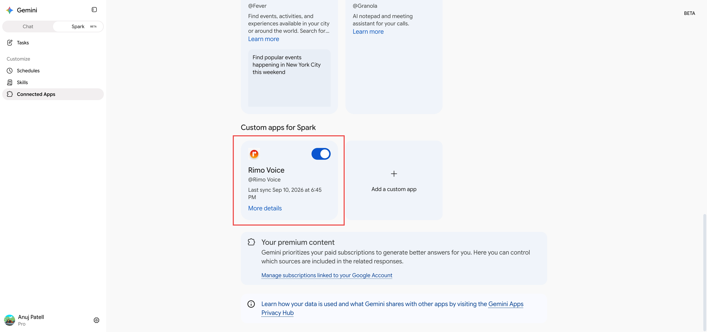
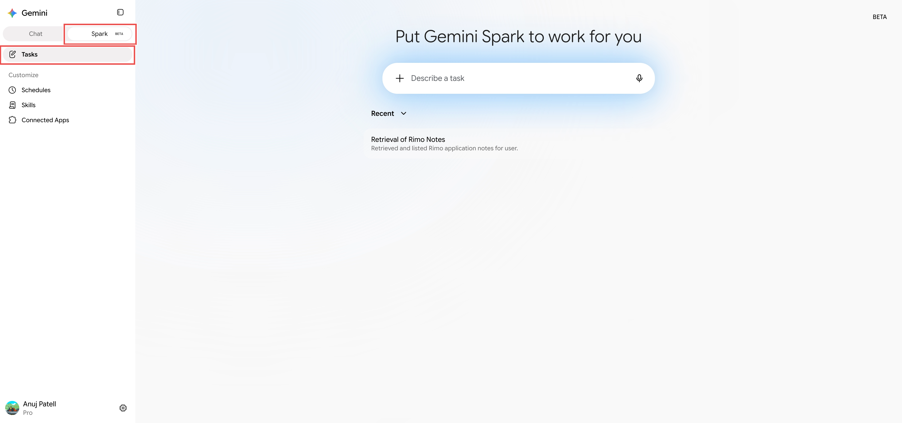
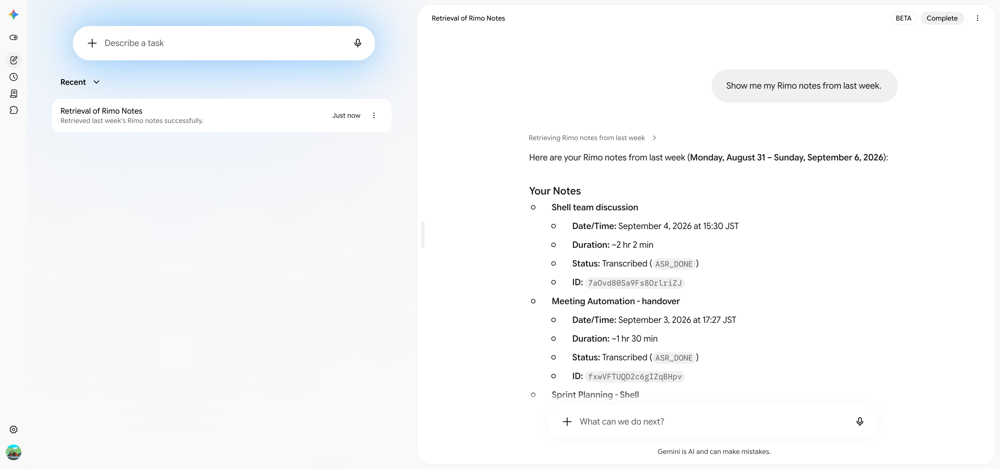

# Rimo in Gemini

[English](../en/rimo-in-gemini.md) | [日本語](../ja/rimo-in-gemini.md)

Connect Rimo to **Gemini** and ask about your meeting notes right inside Gemini Spark. Spark looks things up in Rimo and answers:

- *"Show me my Rimo notes from last week."*
- *"Summarise last week's client meeting from Rimo."*

There is **nothing to install**. You add one link in Gemini's settings, sign in with your usual Rimo account in your browser, and you're done.

**The link to add:**

```
https://mcp.rimo.app/mcp
```

Rimo goes in as a **custom app for Spark** — Google's term for an MCP server you add yourself. Everything below lives in **Spark**, not in ordinary Gemini chat.

> Using Claude, ChatGPT, or Microsoft Copilot instead? See [Rimo in Claude](rimo-in-claude.md), [Rimo in ChatGPT](rimo-in-chatgpt.md), or [Rimo in Microsoft Copilot](rimo-in-microsoft.md). On your own machine with a coding tool (Claude Code, Cursor, Codex)? See [Rimo in Coding Tools](setup-guide.md).

---

## Before you start

- A **Rimo account** — the same one you normally sign in with, in a team / organization.
- **Gemini Spark** on a **Google AI Pro** or **Google AI Ultra** plan. Your plan shows next to your name at the bottom of the Gemini sidebar.
- **A computer.** You add a custom app from Gemini on the web. Once it's connected it works in Spark on mobile too.

Spark and custom apps are both marked **BETA** and are still rolling out, so what you see can differ by account and region — Google lists the current conditions on [its own help page](https://support.google.com/gemini/answer/17209137). If the **Custom apps for Spark** section isn't there, that's why.

You never type a Rimo password or key into Gemini. You sign in on Rimo's own page, in your browser.

---

## Add Rimo as a custom app

1. Open [gemini.google.com](https://gemini.google.com) on your computer and switch from **Chat** to **Spark** at the top of the sidebar.
2. In the sidebar, under **Customize**, click **Connected Apps**.
3. On the **Connected Apps** page, click the **Custom apps** tab.

   

4. Scroll to **Custom apps for Spark**. In **Add a custom app link to get started**, paste the Rimo MCP server URL and click **Next**.

   ```
   https://mcp.rimo.app/mcp
   ```

   

5. The **Set up a custom connected app** dialog opens with the link already filled in. Leave **Advanced Settings** alone and click **Next**.

   

6. Tick **I understand and accept the security and privacy risks of connecting this custom app**, click **Connect**, then **Agree and continue** on the screens that follow.

   

---

## Sign in to Rimo

Gemini sends you to Rimo's own page, headed **Do you allow access to Google?**

1. Under **Account to grant access**, pick the account whose notes Gemini may look at.
2. Click **Allow access**. (**Deny** cancels.)

   

3. Back in Gemini, **Save your custom app** appears. The name is filled in as **Rimo Voice** — change it if you like — and **Available actions** lists the Rimo tools Gemini found. Click **Connect**.

   

Rimo Voice now sits under **Custom apps for Spark** with its toggle on, its handle **@Rimo Voice**, and when it last synced.



> You won't need to do this again unless you disconnect or remove the app.

---

## Use it in Spark

1. In **Spark**, open **Tasks** and click **Describe a task**.

   

2. Ask in plain language — you don't have to name the app, and Spark will reach for Rimo on its own. To point it at Rimo explicitly, mention **@Rimo Voice** in your prompt.

3. Spark runs it as a task and shows what it did, e.g. *"Show me my Rimo notes from last week."*

   

---

## Example things to ask

- "Show me my Rimo notes from this week."
- "Which Rimo meetings did I attend last sprint?"
- "Get the transcript of my last Rimo meeting."
- "Who was in that meeting?"
- "Find my Rimo notes about pricing strategy."
- "Find my notes about onboarding — even the ones that don't use that exact word."
- "Looking at my Rimo notes, what did we decide about the Q3 release?"

Rimo only ever shows Gemini what **you** can see in Rimo.

---

## Switching accounts & turning it off

- **One account at a time.** A connection looks at the single account you picked on the **Do you allow access to Google?** page. To use a different one, remove the app and add it again, choosing the other account.
- **Turn it off for now.** On the **Rimo Voice** card under **Custom apps for Spark**, switch the toggle off. The app stays set up; Spark just stops using it.
- **Disconnect.** Click **More details** on the card and choose to disconnect. This revokes the access you granted but keeps the app in your settings, so you can sign in again later.
- **Remove it.** Use **More details** to remove the app, which unlinks the server from your Google Account.

---

## If something doesn't work

**There's no "Custom apps for Spark" section.** Check that you're on **Spark** rather than **Chat**, and on the **Custom apps** tab of **Connected Apps**. Custom apps need a **Google AI Pro** or **Ultra** plan and are still rolling out — see [Before you start](#before-you-start).

**Spark never uses Rimo.** Make sure the **Rimo Voice** toggle is on under **Custom apps for Spark**, and that you're in **Spark → Tasks** rather than ordinary Gemini chat. Naming **@Rimo Voice** in the prompt removes any doubt.

**Gemini can't find a note you know exists.** It only sees what your own account can see, in the one account you granted access to. If the note belongs to a different organization, remove the app, add it again, and pick that one on the **Do you allow access to Google?** page. A note a colleague never shared with you won't show up.

**Rimo's tools look out of date.** The card shows when it last synced. Removing and re-adding the app gets you a fresh tool list.

**It worked before and now it doesn't.** Open **More details** on the card: if it shows as disconnected, connect and sign in again.

---

## Official Gemini help

- [Connect & manage custom apps for Gemini Spark](https://support.google.com/gemini/answer/17209137)
- [What's new for Gemini Spark](https://support.google.com/gemini/answer/17171264)

---

## See also

- [Rimo in Claude](rimo-in-claude.md) — the same thing for Claude
- [Rimo in ChatGPT](rimo-in-chatgpt.md) — the same thing for ChatGPT
- [Rimo in Microsoft Copilot](rimo-in-microsoft.md) — connect through a Copilot Studio agent using DCR
- [What you can do with MCP](mcp.md) — the tools and example prompts, the same for every client
- [Authentication](authentication.md) — how Rimo sign-in and accounts work
