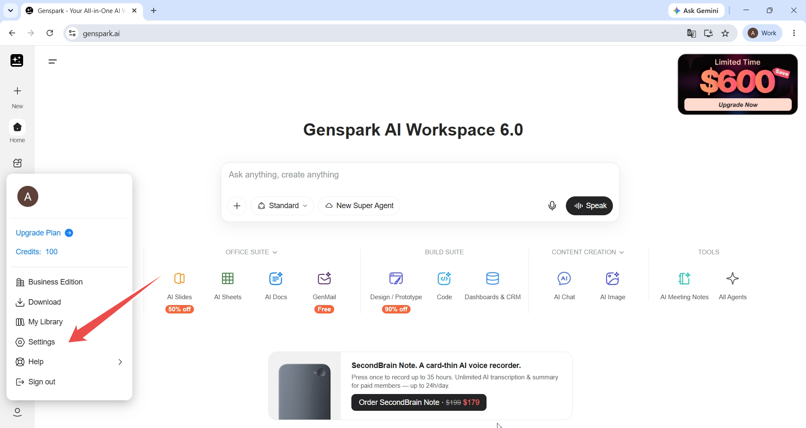
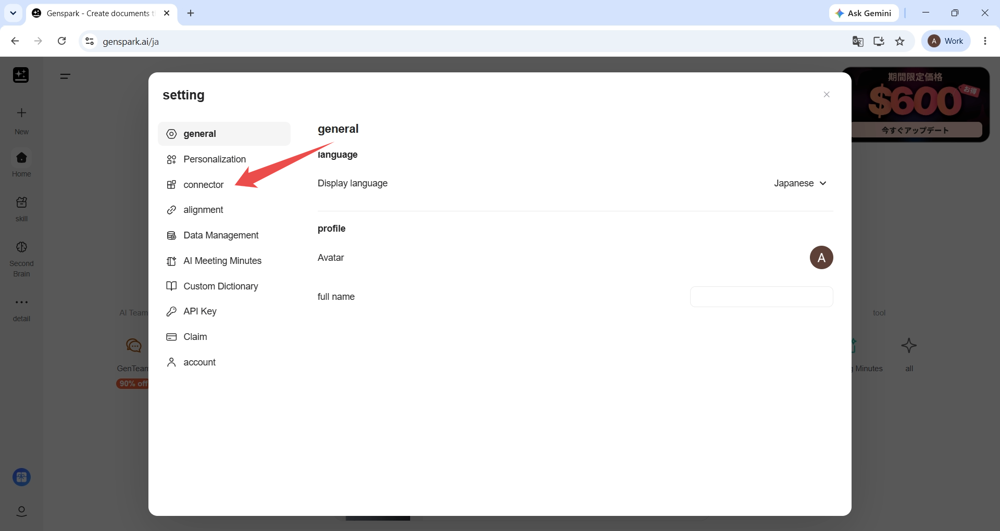
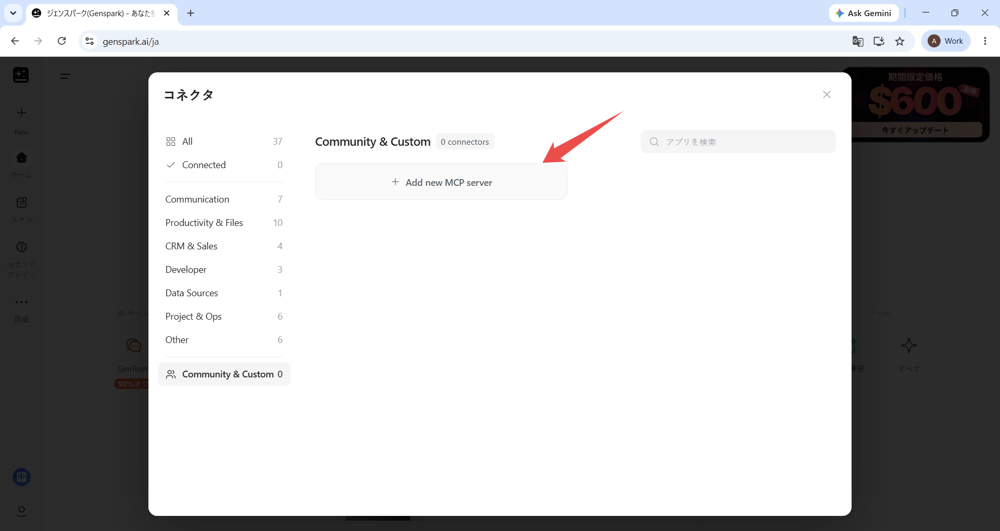
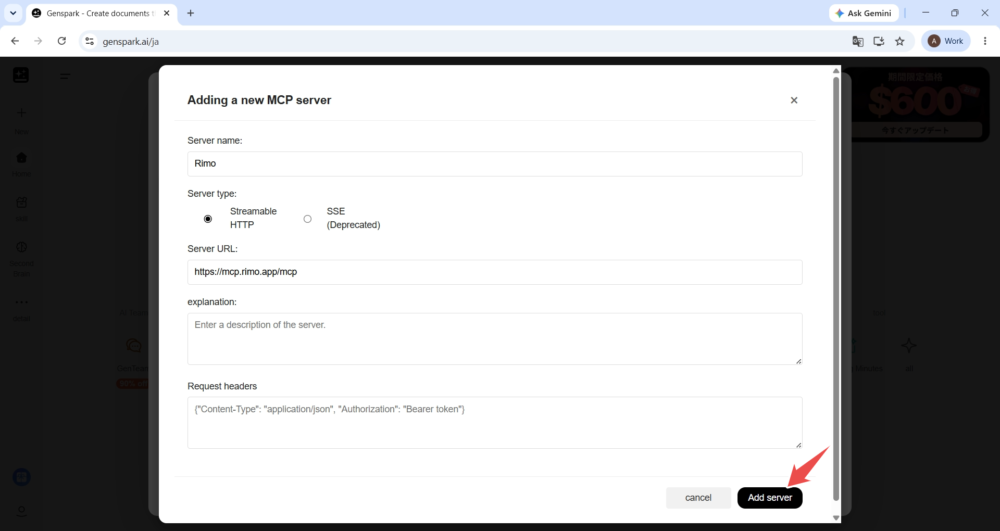
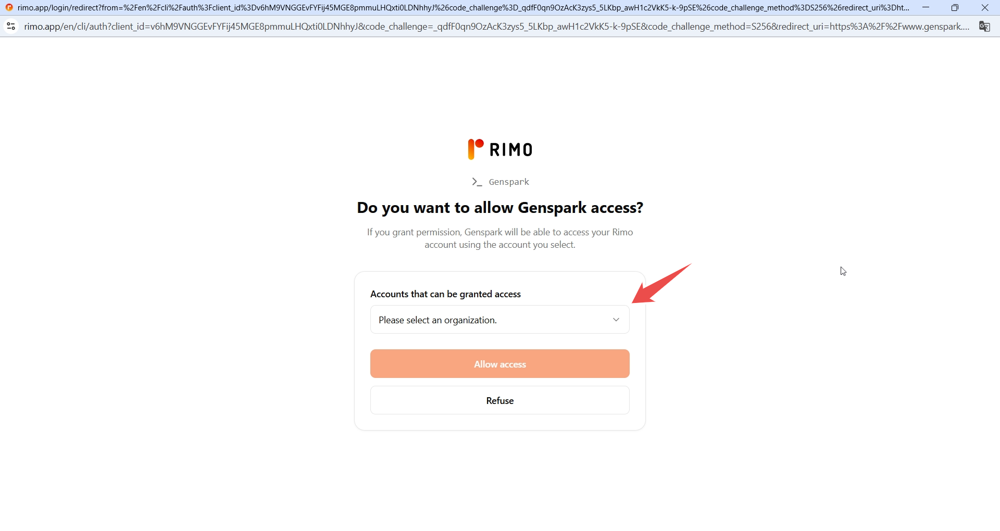
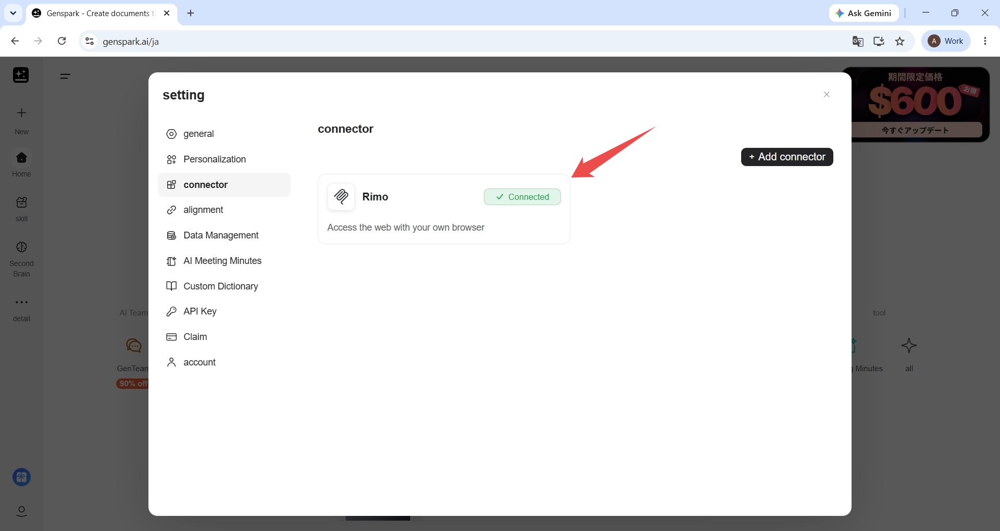
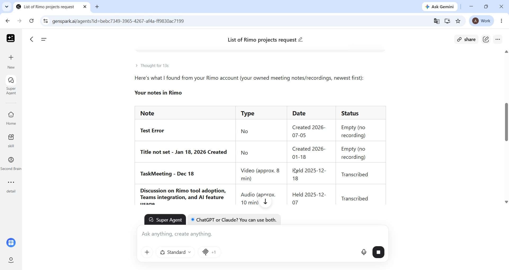

# Rimo in Genspark

[English](../en/rimo-in-genspark.md) | [日本語](../ja/rimo-in-genspark.md)

Ask about your meetings without leaving Genspark. You add Rimo to Genspark once as a **custom MCP server**, sign in with your own Rimo account, and then ask in plain language — *"Give me a list of my projects at Rimo"* — and Genspark looks the answer up in your meeting notes and replies.

**The server URL to add:**

```
https://mcp.rimo.app/mcp
```

> Using Claude, ChatGPT, Gemini, Notion, or Microsoft Copilot instead? See [Rimo in Claude](rimo-in-claude.md), [Rimo in ChatGPT](rimo-in-chatgpt.md), [Rimo in Gemini](rimo-in-gemini.md), [Rimo in Notion](rimo-in-notion.md), or [Rimo in Microsoft Copilot](rimo-in-microsoft.md). On your own machine with a coding tool (Claude Code, Cursor, Codex)? See [Rimo in Coding Tools](setup-guide.md).

---

## Before you start

- A **Genspark account** — the one you sign in with at [genspark.ai](https://www.genspark.ai). Nothing to install.
- A **Rimo account** — the same one you normally sign in with, in an organization.

> You never type a Rimo password or key into Genspark. You sign in on Rimo's own page, in your browser.

---

## Add Rimo to Genspark

### 1. Open Genspark's settings

Sign in to Genspark, open your account menu at the bottom of the left sidebar, and select **Settings**.



### 2. Go to Connector

In the settings dialog, select **Connector** from the list on the left.



### 3. Add a connector

On the **Connector** page, select **Add connector**. Genspark's connector catalogue opens.

### 4. Open Community & Custom

In the catalogue, select **Community & Custom** at the bottom of the category list, then select **Add new MCP server**.



### 5. Enter the Rimo server details

Fill in the form, then select **Add server**:

- **Server name:** `Rimo`
- **Server type:** **Streamable HTTP**
- **Server URL:** `https://mcp.rimo.app/mcp`
- **Description:** `Rimo — list, read, search, and ask across your meeting notes, transcripts, and documents.`

Leave **Request headers** empty — you sign in to Rimo in the next step, so there is nothing to paste here.



### 6. Sign in to Rimo and allow access

Rimo opens in your browser and asks whether to allow access to Genspark. Sign in if you're prompted to, then under **Accounts that can be granted access** choose the Rimo organization Genspark may use and select **Allow access**.



### 7. Check that Rimo is connected

Back in Genspark, Rimo is listed on the **Connector** page with a **Connected** label.



### 8. Ask your first question

Open **Super Agent** and ask in plain language. A listing question is the quickest way to confirm the connection works:

```
Give me a list of my projects at Rimo.
```

Genspark calls Rimo and answers from the notes your own Rimo account can see.



From there, ask about a meeting the way you'd ask a colleague — see [Example things to ask](#example-things-to-ask).

---

## Example things to ask

Name the meeting you mean — *"my last meeting"*, *"last week's meetings"*, *"our client meeting"* — and ask:

- "Give me a list of my projects at Rimo."
- "Tell me about my last Rimo meeting."
- "What were the key decisions from last week's meetings?"
- "What action items came out of our client meeting?"
- "Who attended the meeting?"
- "How long did the meeting last?"
- "Find the meeting where we discussed the Q3 roadmap."
- "What did we decide about the product launch?"

You only ever see what **you** can see in Rimo, and the connection is read-only — nothing it does changes anything in your notes. For the full list of what it can reach, see [What you can do with MCP](mcp.md).

---

## Good to know

- **Ask in Super Agent.** That's where Genspark uses your Rimo connection.
- **Say *Rimo* in the question** — *"my Rimo notes"*, *"my projects at Rimo"* — so Genspark reaches for your meeting notes rather than answering from elsewhere.
- **Pick Streamable HTTP as the server type.** The other option in the form, **SSE (Deprecated)**, is not the one to use.
- **One Rimo organization at a time.** The organization you pick at **Allow access** is the one Genspark sees. To use a different one, remove the Rimo connector and add it again, choosing the other organization.

---

## Official Genspark help

- [Genspark Help Center](https://www.genspark.ai/helpcenter)
- [Connectors & Integrations](https://www.genspark.ai/helpcenter/connectors-and-integrations) — Genspark's own guide to its connector catalogue

---

## See also

- [Rimo in Others](rimo-in-others.md) — every other tool Rimo works in
- [What you can do with MCP](mcp.md) — the tools and example prompts, once you are connected
- [Rimo in Claude](rimo-in-claude.md) — the same thing for Claude
- [Rimo in ChatGPT](rimo-in-chatgpt.md) — the same thing for ChatGPT
- [Rimo in Gemini](rimo-in-gemini.md) — the same thing for Gemini Spark
- [Rimo in Notion](rimo-in-notion.md) — the same thing for a Notion Custom Agent
- [Rimo in Microsoft Copilot](rimo-in-microsoft.md) — connect through a Copilot Studio agent using DCR
- [Authentication](authentication.md) — how Rimo sign-in and accounts work
