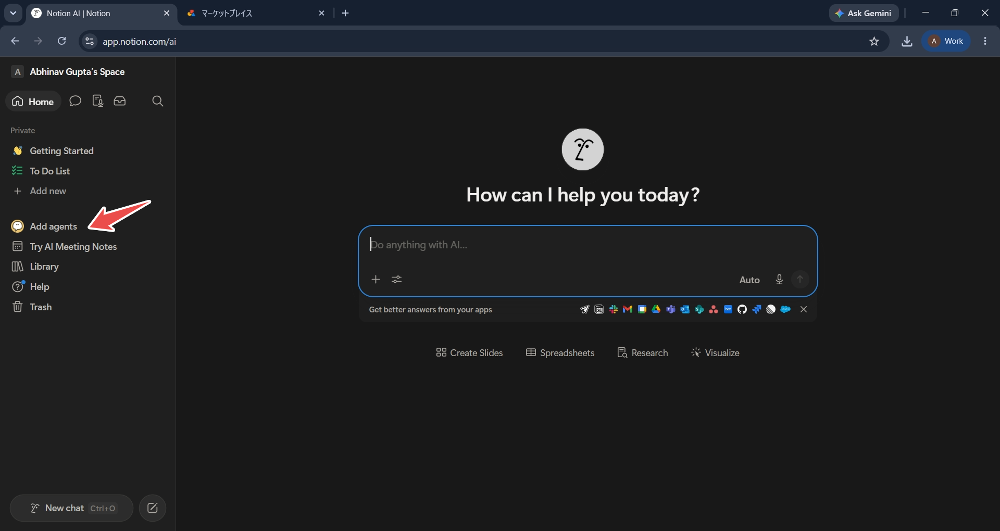
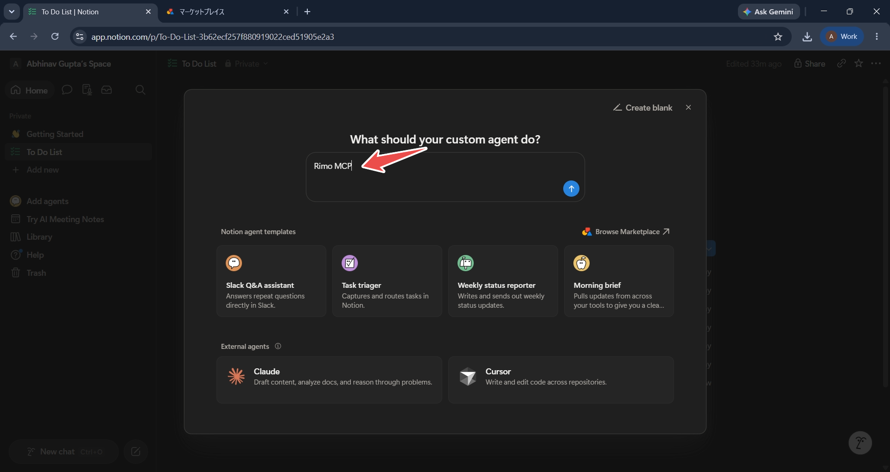
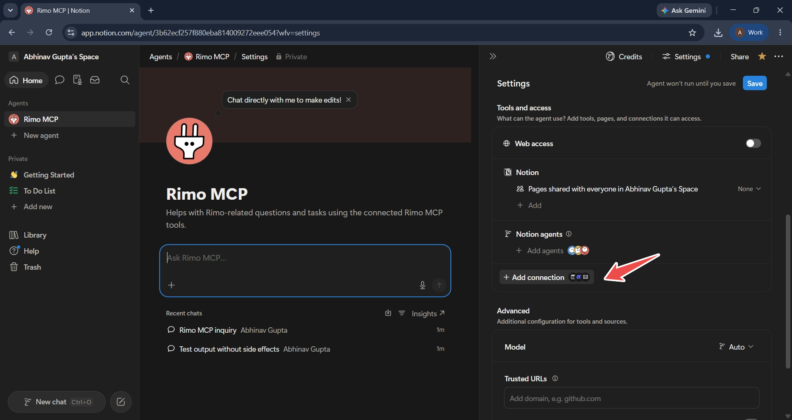
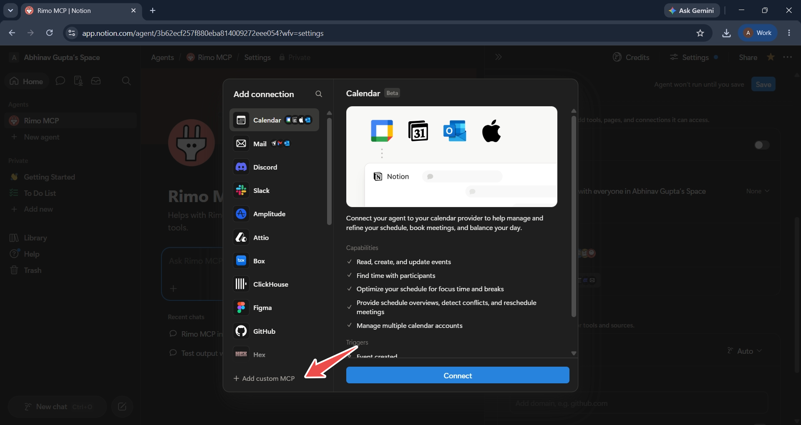
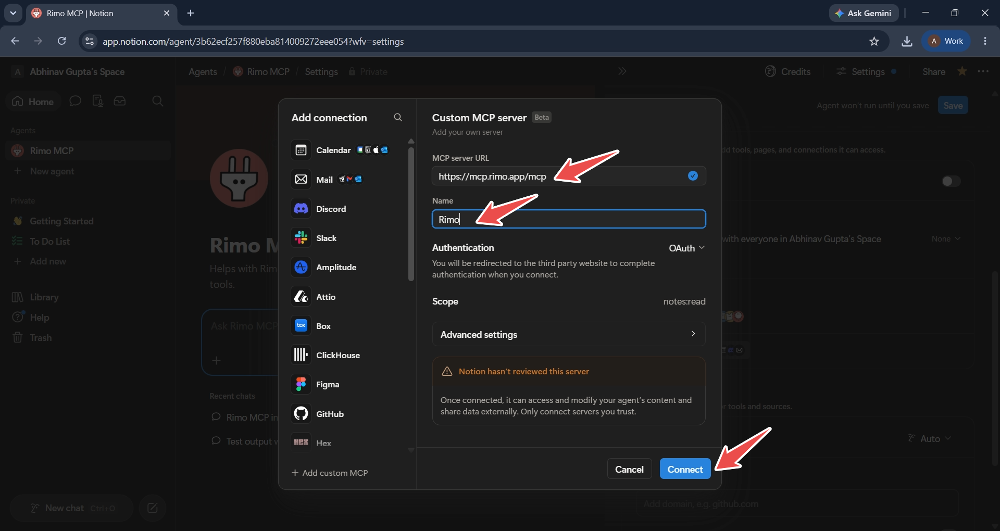
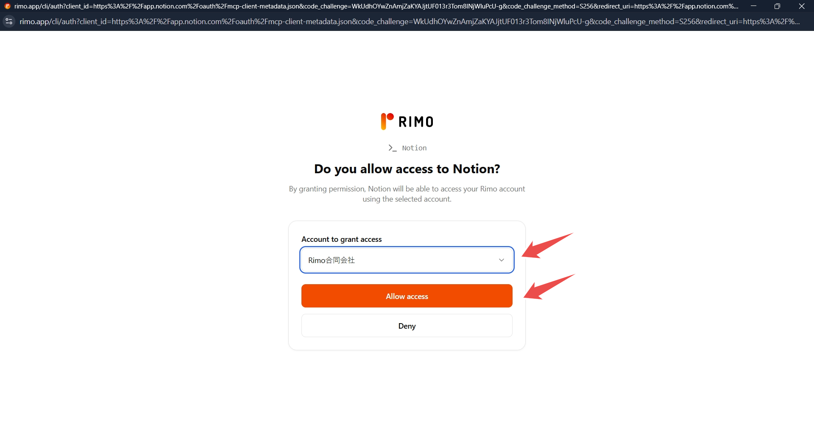
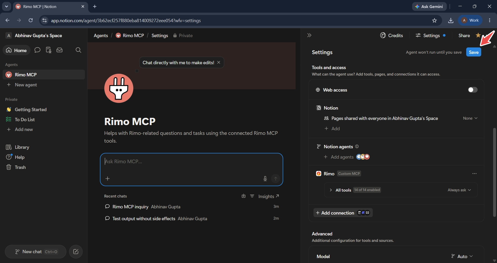
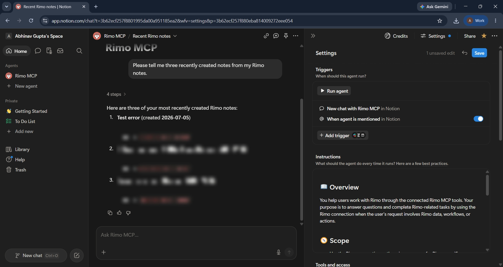

# Rimo in Notion

[English](../en/rimo-in-notion.md) | [日本語](../ja/rimo-in-notion.md)

Ask about your meetings without leaving Notion. You add Rimo to a Notion **Custom Agent** once as a **custom MCP** connection, sign in with your own Rimo account, and then ask in plain language — *"What did we decide about pricing?"* — and the agent looks the answer up in your meeting notes and replies.

Ask what a meeting covered, what was decided, what the action items are, who attended, when it was held and how long it ran, or search back for an older meeting. See [Example things to ask](#example-things-to-ask).

**The server URL to add:**

```
https://mcp.rimo.app/mcp
```

> **Rimo runs on a Custom Agent, not in ordinary Notion AI chat.** Per Notion's documentation, MCP connections are available to Custom Agents only.

> Using Claude, ChatGPT, or Microsoft Copilot instead? See [Rimo in Claude](rimo-in-claude.md), [Rimo in ChatGPT](rimo-in-chatgpt.md), or [Rimo in Microsoft Copilot](rimo-in-microsoft.md). On your own machine with a coding tool (Claude Code, Cursor, Codex)? See [Rimo in Coding Tools](setup-guide.md).

---

## Before you start

- A **Notion workspace** on a plan that includes MCP connections — Notion's documentation lists them as available on **Business** and **Enterprise**.
- **Custom MCP servers enabled for the workspace.** If **Add custom MCP** isn't in the connection list, a workspace owner or admin has to turn it on — see [Notion's MCP connections guide](https://www.notion.com/help/mcp-connections-for-custom-agents).
- A **Rimo account** — the same one you normally sign in with, in an organization. Nothing to install.

> You never type a Rimo password or key into Notion. You sign in on Rimo's own page, in your browser.

---

## Add Rimo to a Custom Agent

### 1. Create a Custom Agent

In Notion's sidebar, select **Add agents**.



Describe what the agent is for — for example `Rimo MCP` — and create it. **Create blank** skips the description.



### 2. Open Tools and access

Open the agent's **Settings**, go to **Tools and access**, and select **Add connection**.



### 3. Add a custom MCP connection

The connection list opens. At the bottom, select **Add custom MCP**.



### 4. Enter the Rimo server details

Fill in the server details, then select **Connect**:

- **MCP server URL:** `https://mcp.rimo.app/mcp`
- **Name:** `Rimo`
- **Authentication:** **OAuth**

Notion shows the requested **Scope** — `notes:read` — and a *Notion hasn't reviewed this server* notice, because Rimo is a server you add yourself rather than a Notion-reviewed integration.



### 5. Sign in to Rimo

Rimo opens in your browser and asks whether to allow access to Notion. Under **Account to grant access**, choose the Rimo organization the agent may use, then select **Allow access**.



### 6. Save the agent

Back in Notion, Rimo is listed under **Tools and access** with a **Custom MCP** label. Select **Save** — the agent won't run until you do.



### 7. Ask your first question

Open the agent and ask in plain language. A listing question is the quickest way to confirm the connection works:

```
Please tell me three recently created notes from my Rimo notes.
```

The agent calls Rimo and answers from the notes your own Rimo account can see.



From there, ask about a meeting the way you'd ask a colleague — see [Example things to ask](#example-things-to-ask).

---

## Example things to ask

No commands to memorise. Name the meeting you mean — *"my last meeting"*, *"last week's meetings"*, *"our client meeting"* — and ask:

- "Tell me about my last meeting."
- "What were the key decisions from last week's meetings?"
- "What action items came out of our client meeting?"
- "Who attended the meeting?"
- "How long did the meeting last?"
- "Find the meeting where we discussed the Q3 roadmap."
- "What did we decide about the product launch?"

You only ever see what **you** can see in Rimo, and the connection is read-only — nothing it does changes anything in your notes. For the full list of what it can reach, see [What you can do with MCP](mcp.md).

---

## Good to know

- **Custom Agents only.** Per Notion's documentation, MCP connections don't work in ordinary Notion AI chat.
- **The connection belongs to one agent.** Notion's documentation states each MCP connection is unique to a single Custom Agent, so another agent needs its own.
- **Save after you connect.** Notion warns that the agent won't run until the settings are saved.
- **One Rimo organization at a time.** The organization you pick at **Allow access** is the one the agent sees. To use a different one, remove the Rimo connection in **Tools and access** and add it again, choosing the other organization.
- **Read-only.** The connection asks for the `notes:read` scope, so the agent can read your notes but never change them — see [What you can do with MCP](mcp.md).
- **Custom MCP is labelled Beta** in Notion.

---

## Official Notion help

- [MCP connections for Notion Custom Agents](https://www.notion.com/help/mcp-connections-for-custom-agents)
- [Connect Custom Agents to your tool stack with MCP integrations](https://www.notion.com/help/guides/connect-custom-agents-to-mcp-integrations)
- [Security best practices for Agent connections](https://www.notion.com/help/security-best-practices-for-agent-connections)

---

## See also

- [Rimo in Others](rimo-in-others.md) — every other tool Rimo works in
- [What you can do with MCP](mcp.md) — the tools and example prompts, once you are connected
- [Rimo in Claude](rimo-in-claude.md) — the same thing for Claude
- [Rimo in ChatGPT](rimo-in-chatgpt.md) — the same thing for ChatGPT
- [Rimo in Microsoft Copilot](rimo-in-microsoft.md) — connect through a Copilot Studio agent using DCR
- [Authentication](authentication.md) — how Rimo sign-in and accounts work
