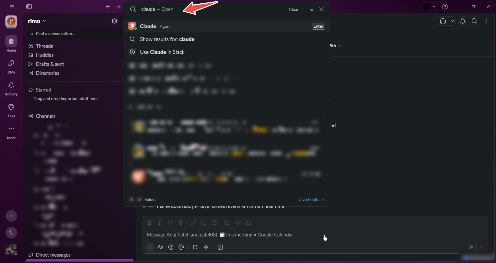
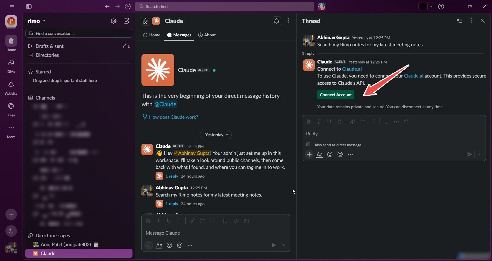
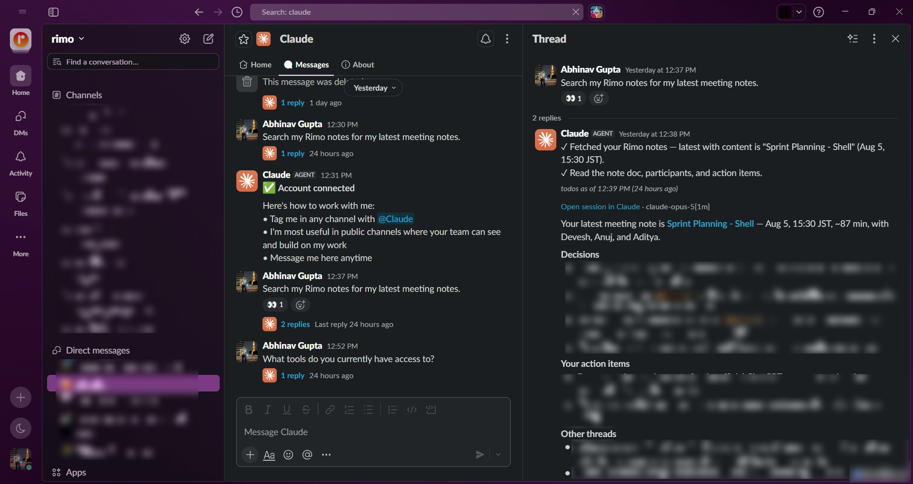

# Rimo in Slack

[English](../en/rimo-in-slack.md) | [日本語](../ja/rimo-in-slack.md)

Ask about your meetings from Slack. Once the **Rimo Voice** connector is on your Claude account, you can message Claude in Slack — *"What did we decide about pricing?"* — and get an answer read straight out of your Rimo meeting notes, without leaving Slack or opening Rimo.

You can ask what a meeting covered, what was decided, what the action items are, who attended, when it was held and how long it ran — or search back through past meetings for the one you only half-remember. See [Example things to ask](#example-things-to-ask).

**Start in a DM with Claude.** It's the most reliable place to reach your Rimo notes, and the easiest place to confirm the connector is working before you use it anywhere else.

Claude runs in more than one place — **claude.ai** in the browser, the **Claude desktop app**, and **Claude in Slack** (also called **Claude Tag**). This page covers the **Slack** side.

> **Whether Rimo is reachable from a given place in Slack depends on your setup.** See [Where Rimo is available](#where-rimo-is-available).

> Setting up the connector for the first time? Do that on [Rimo in Claude](rimo-in-claude.md) first — it walks through the connector directory and the Rimo sign-in. This page picks up from there. Using ChatGPT or Microsoft Copilot instead? See [Rimo in ChatGPT](rimo-in-chatgpt.md) or [Rimo in Microsoft Copilot](rimo-in-microsoft.md). On your own machine with a coding tool (Claude Code, Cursor, Codex)? See [Rimo in Coding Tools](setup-guide.md).

---

## Before you start

- A **Rimo account** — the same one you normally sign in with, in an organization.
- A **Claude account**. Claude Tag is available on the **Team** and **Enterprise** plans, **in beta**.
- A **Slack workspace** with the **Claude app installed**. If it isn't installed, your Slack workspace administrator has to add it — see [If something doesn't work](#if-something-doesn-t-work).
- **The Rimo Voice connector connected** to your Claude account — see [Rimo in Claude](rimo-in-claude.md).
- **Admin access to Claude Tag**, for channel use. Only a Claude **Primary Owner** or **Owner** can set it up — the plain **Admin** role can't. If you aren't an Owner, ask whoever manages your Claude workspace.

> You never type a Rimo password or key into Claude or Slack. You sign in on Rimo's own page, in your browser.

---

## Set up Claude in Slack

### 1. Install the Claude app in Slack

Add the **Claude** app to your Slack workspace from the Slack app directory. Most workspaces restrict who may install apps, so this is often a job for your Slack administrator.

### 2. Find Claude in Slack

Search Slack for `claude`, then open the **Claude** app to start a direct message.



### 3. Connect your Claude account

The first time you open Claude in Slack, it asks you to connect your Claude account. Follow the prompt and **sign in with the same Claude account that has the Rimo Voice connector connected** — otherwise Rimo won't be among Claude's tools, even though the setup looks complete.



### 4. Connect the Rimo Voice connector

The connector is set up in **Claude's own settings**, not in Slack. If you haven't done it yet, open **[Customize → Connectors](https://claude.ai/customize/connectors)**, click **Connect** on Rimo Voice, then sign in to Rimo and pick an organization — [Rimo in Claude](rimo-in-claude.md) walks through it.

For **channels**, Claude Tag's tools are configured separately at **[Admin settings → Claude Tag](https://claude.ai/admin-settings/claude-tag)**, per organization, workspace, or single channel. If Rimo isn't reachable from a channel, this is the setting to ask an Owner about.

### 5. Check what Claude can reach

In the DM, ask:

```
Which connectors do you have available?
```

This tells you whether Rimo Voice is reachable before you involve a channel.

### 6. Ask your first question

In the DM, ask about a meeting the way you'd ask a colleague:

```
Search my Rimo notes for my latest meeting notes.
```

Claude finds the note and answers with what the meeting was, when it was held, how long it ran, who was there, the decisions, and your action items.



Claude replies in a thread and keeps working there, so you can follow up without repeating yourself. For decisions, action items, attendees, a specific topic, or an older meeting you need to dig up, see [Example things to ask](#example-things-to-ask).

You can ask from a channel too, but whether Rimo is reachable there varies — see [Where Rimo is available](#where-rimo-is-available).

---

## Where Rimo is available

Rimo's reachability is **not the same everywhere in Slack**. It depends on:

- **The environment Claude is running in** may not be able to reach Rimo.
- **Your Slack workspace configuration**, including which channels Claude Tag is set up for.
- **Connector availability** — whether Rimo Voice is among the tools available in the place you're asking from.
- **Claude Tag setup**, which an Owner configures separately from the connectors on an individual Claude account.

> **For Rimo meeting notes, start in a DM with Claude.** It's the most reliable place to confirm your Rimo access. If Claude can't reach Rimo from a channel, check your workspace configuration, Claude Tag configuration, and connector setup.

If Rimo isn't available where you're asking, work through [Claude answers but not from my Rimo notes](#claude-answers-but-not-from-my-rimo-notes).

---

## How to ask in Slack

In a **DM with Claude**, or the Claude side panel from Slack's AI assistant header, just type your question — no mention needed.

From a **channel**, you have to **tag @Claude** for your question to reach it at all; a channel message that doesn't mention Claude is never seen. Once a thread is under way you **don't need to tag @Claude again** — it follows the thread and keeps the context of what you've already asked, so you can just reply:

```
Now group those action items by owner.
```

---

## Example things to ask

Ask about your meetings the way you'd ask a colleague:

- "Tell me about this meeting."
- "What were the main points discussed?"
- "What decisions were made?"
- "What were the action items?"
- "Who attended this meeting?"
- "How long did this meeting last?"
- "What did we discuss about the product launch?"
- "What did we decide about pricing?"
- "Find the meeting where we discussed the Q3 roadmap."
- "What did we discuss in our last meeting with the client?"

Say *Rimo* somewhere in the question — *"my Rimo notes"*, *"my last Rimo meeting"* — if Claude answers from the surrounding Slack messages instead of your meeting notes.

---

## Limitations

- **Rimo notes may not be reachable from a channel.** A DM is the reliable place — see [Where Rimo is available](#where-rimo-is-available).
- **You only ever see your own notes.** Rimo shows Claude what **you** can see in Rimo; a note a colleague never shared with you won't appear.
- **One Rimo organization at a time** — the one the connector was signed in to.
- **Read-only.** Every Rimo Voice tool only reads — nothing Claude does changes anything in Rimo.

---

## If something doesn't work

### I don't see Claude in Slack

The Claude app isn't installed in your workspace, or installing apps is restricted. **Contact your Slack workspace administrator** to have the Claude app added or approved — this isn't something you can enable from your own Slack account.

### Claude asks me to connect my account

Slack needs your **Claude account** linked before Claude can do anything. Follow the prompt and sign in, using the **same Claude account** that has Rimo Voice connected.

### Claude answers but not from my Rimo notes

Work through these in order:

1. **Ask for Rimo explicitly.** Say *"search my Rimo notes for…"* or *"according to my Rimo notes"*. Without that, Claude may answer from the Slack conversation alone.
2. **Try it in a Claude DM.** Reachability can differ between a channel and a DM, and a DM is the recommended place to verify Rimo access.
3. **Check the connector.** Confirm the Claude account Slack is linked to has **Rimo Voice** connected at **[Customize → Connectors](https://claude.ai/customize/connectors)**.
4. **Ask an Owner to check the channel.** If Claude says it can't reach Rimo rather than that it found nothing, the problem is where Claude is running, not your question. Ask a Claude **Owner** to check the Claude Tag setup for that channel at **[Admin settings → Claude Tag](https://claude.ai/admin-settings/claude-tag)**.

### Claude can't find a note I know exists

Claude only sees what your own Rimo account can see, in the one organization the connector was signed in to. If the note is in a different organization, reconnect and pick that one. A note a colleague never shared with you won't show up.

---

## Official Claude help

- [Claude Tag overview](https://claude.com/docs/claude-tag/overview)
- [What is Claude Tag?](https://support.claude.com/en/articles/15594475-what-is-claude-tag)
- [Use connectors to extend Claude's capabilities](https://support.claude.com/en/articles/11176164-use-connectors-to-extend-claude-s-capabilities)

---

## See also

- [Rimo in Claude](rimo-in-claude.md) — connect the Rimo Voice connector (start here)
- [Rimo in Others](rimo-in-others.md) — every other tool Rimo works in
- [What you can do with MCP](mcp.md) — the tools and example prompts, once you are connected
- [Rimo in ChatGPT](rimo-in-chatgpt.md) — the same thing for ChatGPT
- [Rimo in Microsoft Copilot](rimo-in-microsoft.md) — connect through a Copilot Studio agent using DCR
- [Authentication](authentication.md) — how Rimo sign-in and accounts work
