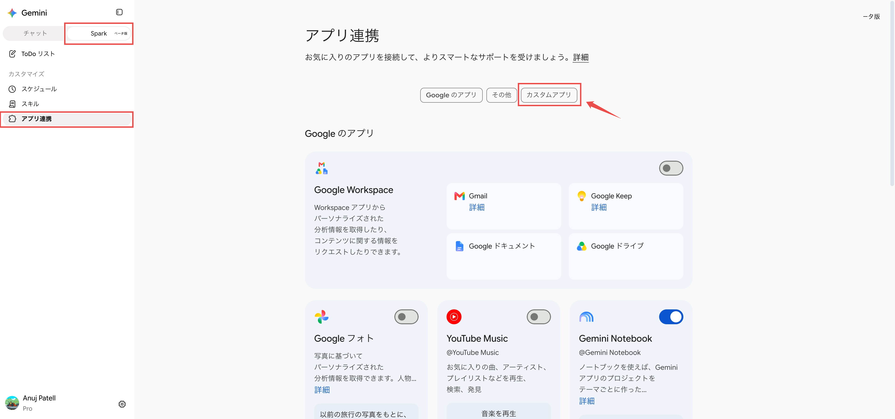
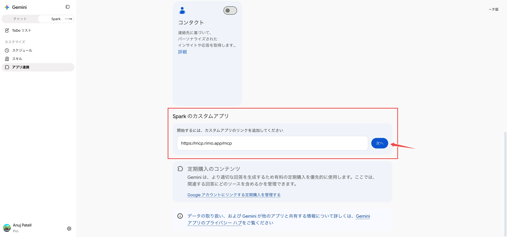
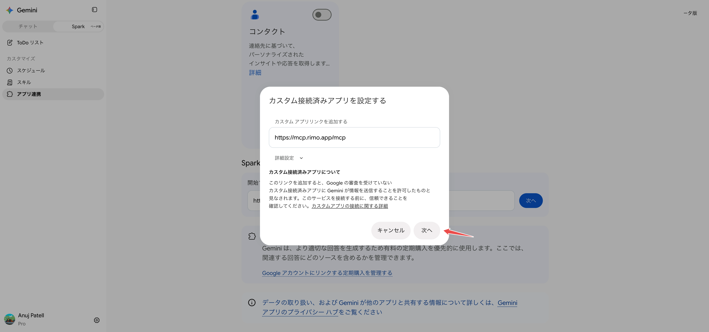
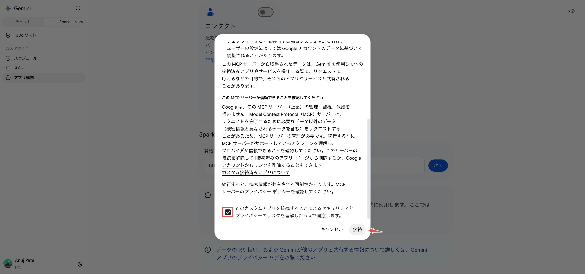
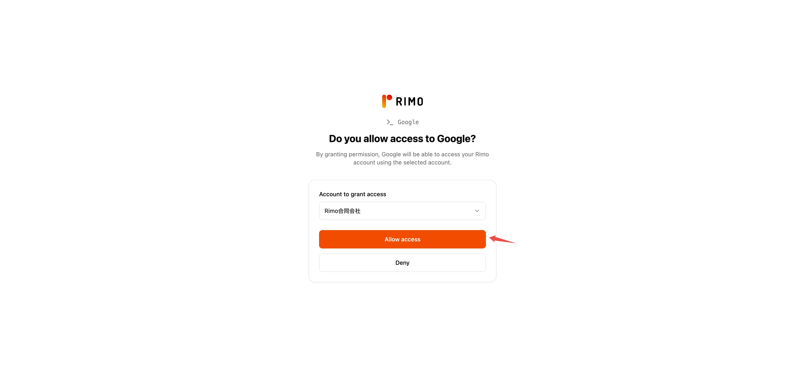
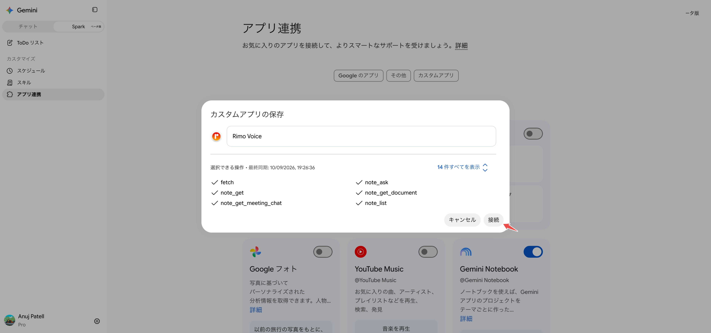
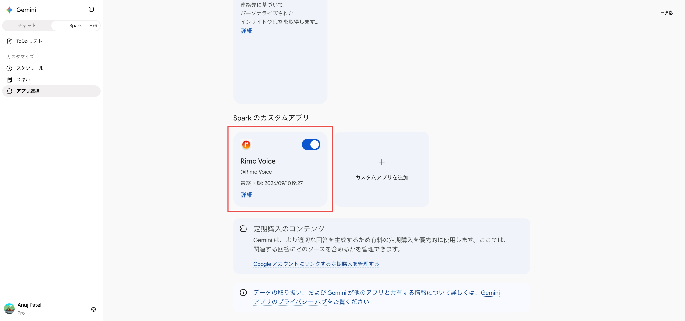
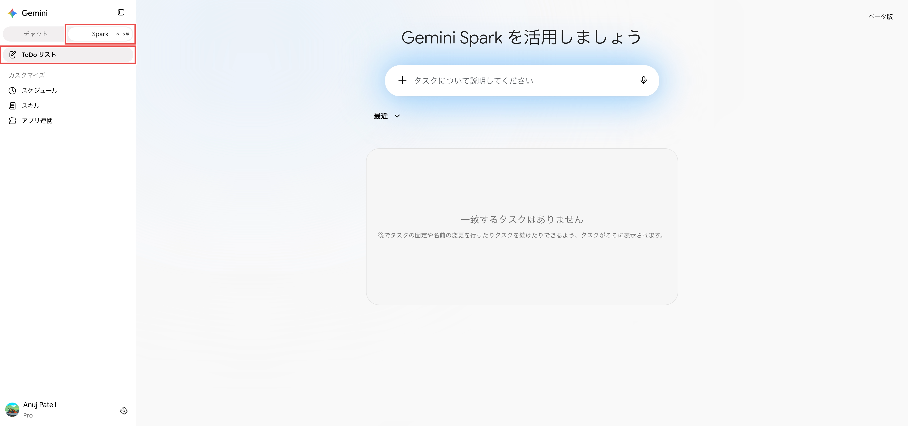
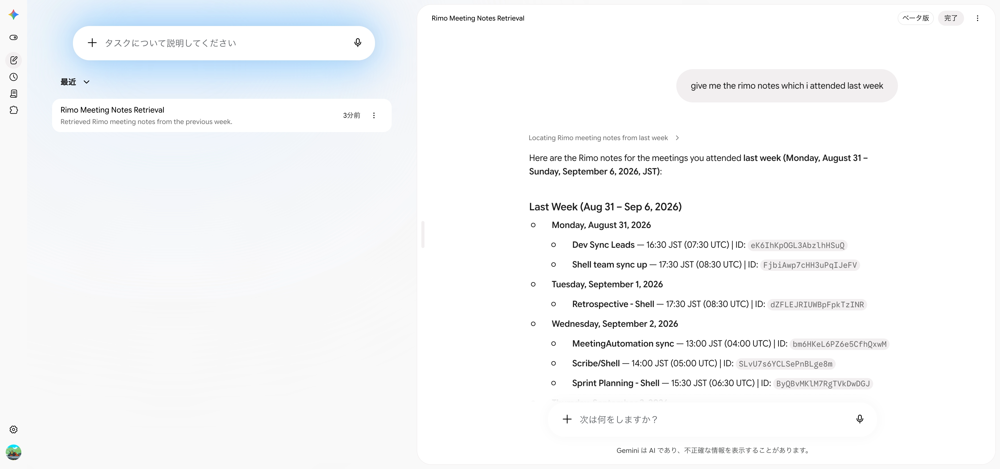

# Gemini で Rimo を使う

[English](../en/rimo-in-gemini.md) | [日本語](../ja/rimo-in-gemini.md)

Rimo を **Gemini** につなぐと、Gemini Spark の中でそのまま自分のミーティングノートについて質問できます。Spark が Rimo を調べて答えてくれます。

- *「先週の Rimo のノートを見せて。」*
- *「Rimo の先週のクライアント面談を要約して。」*

**インストールするものはありません。** Gemini の設定にリンクを 1 つ追加し、ブラウザでいつもの Rimo アカウントにサインインするだけです。

**追加するリンク:**

```
https://mcp.rimo.app/mcp
```

Rimo は **Spark のカスタムアプリ（custom app for Spark）** として追加します。これは、自分で追加する MCP サーバーを指す Google 側の呼び方です。以下の操作はすべて **Spark** 側で行います。通常の Gemini のチャットではありません。

> Claude、ChatGPT、Microsoft Copilot をお使いですか? [Claude で Rimo を使う](rimo-in-claude.md)、[ChatGPT で Rimo を使う](rimo-in-chatgpt.md)、[Microsoft Copilot で Rimo を使う](rimo-in-microsoft.md) を参照してください。自分のマシンのコーディングツール（Claude Code、Cursor、Codex）の場合は [コーディングツールで使う](setup-guide.md) を参照してください。

---

<a id="before-you-start"></a>

## はじめる前に

- **Rimo アカウント** — いつもサインインしているものと同じ。チーム／組織に所属していること。
- **Gemini Spark** が使えること。プランは **Google AI Pro** または **Google AI Ultra**。ご自分のプランは、Gemini のサイドバー下部の名前の横に表示されます。
- **パソコン。** カスタムアプリの追加は Web 版の Gemini から行います。接続したあとは、モバイルの Spark でも使えます。

Spark もカスタムアプリも **ベータ版** で、段階的に提供が広がっています。そのため、表示される内容はアカウントや地域によって変わることがあります。最新の条件は [Google のヘルプページ](https://support.google.com/gemini/answer/17209137) を参照してください。**「Spark のカスタムアプリ」** のセクションが見つからない場合は、これが理由です。

Rimo のパスワードやキーを Gemini に入力することはありません。サインインは、ブラウザ上の Rimo 自身のページで行います。

---

## Rimo をカスタムアプリとして追加する

1. パソコンで [gemini.google.com](https://gemini.google.com) を開き、サイドバー上部で **チャット（Chat）** から **Spark** に切り替えます。
2. サイドバーの **カスタマイズ（Customize）** にある **アプリ連携（Connected Apps）** をクリックします。
3. **アプリ連携** のページで **カスタムアプリ（Custom apps）** のタブをクリックします。

   

4. **Spark のカスタムアプリ（Custom apps for Spark）** までスクロールします。**「開始するには、カスタムアプリのリンクを追加してください」** の入力欄に Rimo の MCP サーバー URL を貼り付け、**次へ（Next）** をクリックします。

   ```
   https://mcp.rimo.app/mcp
   ```

   

5. **カスタム接続済みアプリを設定する（Set up a custom connected app）** のダイアログが、リンクが入力済みの状態で開きます。**詳細設定（Advanced Settings）** は触らずに **次へ** をクリックします。

   

6. **「このカスタムアプリを接続することによるセキュリティとプライバシーのリスクを理解したうえで同意します。」** にチェックを入れて **接続（Connect）** をクリックし、続く画面で **同意して続行（Agree and continue）** をクリックします。

   

---

## Rimo にサインインする

Gemini が Rimo 自身のページ **「Do you allow access to Google?（Google にアクセスを許可しますか?）」** に移動します。

1. **Account to grant access（アクセスを許可するアカウント）** で、Gemini が参照してよいアカウントを選びます。
2. **Allow access（アクセスを許可する）** をクリックします。（**Deny** でキャンセルできます。）

   

3. Gemini に戻ると **カスタムアプリの保存（Save your custom app）** が表示されます。名前は **Rimo Voice** が入力済みです（変更もできます）。**選択できる操作（Available actions）** に、Gemini が見つけた Rimo のツールが一覧表示されます。**接続** をクリックします。

   

これで **Spark のカスタムアプリ** に Rimo Voice が並びます。トグルはオン、ハンドルは **@Rimo Voice**、最終同期の時刻も表示されます。



> 切断またはアプリを削除しない限り、この操作をもう一度行う必要はありません。

---

## Spark で使う

1. **Spark** で **ToDo リスト（Tasks）** を開き、**「タスクについて説明してください（Describe a task）」** をクリックします。

   

2. 普通の言葉で質問します。アプリ名を指定する必要はなく、Spark が自分で Rimo を使ってくれます。明示的に Rimo を指定したい場合は、プロンプトで **@Rimo Voice** に言及してください。

3. Spark はこれをタスクとして実行し、何をしたかを表示します。例：*「先週参加した Rimo のノートをください。」*

   

---

## 質問の例

- 「今週の Rimo のノートを見せて。」
- 「先週のスプリントで参加した Rimo のミーティングは？」
- 「直近の Rimo ミーティングの文字起こしを取得して。」
- 「そのミーティングには誰がいた？」
- 「価格戦略に関する Rimo のノートを探して。」
- 「オンボーディングに関するノートを探して。直接オンボーディングという単語がなくても関連するものは含めて。」
- 「Rimo のノートを見て、Q3 リリースについて何を決めたか教えて。」

Rimo は、**あなた自身が Rimo で閲覧権限があるもの** しか Gemini に見せません。

---

## アカウントの切り替えと停止

- **一度に 1 つのアカウント。** 接続は、**「Do you allow access to Google?」** の画面で選んだ 1 つのアカウントを対象にします。別のアカウントを使いたい場合は、アプリを削除してもう一度追加し、そのときに別のアカウントを選びます。
- **一時的にオフにする。** **Spark のカスタムアプリ** にある **Rimo Voice** のカードでトグルをオフにします。設定自体は残り、Spark が使わなくなるだけです。
- **切断する。** カードの **詳細（More details）** を開いて切断します。付与したアクセス権は取り消されますが、アプリは設定に残るので、あとでもう一度サインインできます。
- **削除する。** **詳細** からアプリを削除すると、サーバーと Google アカウントの紐付けが解除されます。

---

## うまくいかないとき

**「Spark のカスタムアプリ」のセクションがない。** **チャット** ではなく **Spark** になっているか、そして **アプリ連携** の **カスタムアプリ** タブを開いているか確認してください。カスタムアプリには **Google AI Pro** または **Ultra** プランが必要で、提供も段階的です（「[はじめる前に](#before-you-start)」を参照）。

**Spark が Rimo を使ってくれない。** **Spark のカスタムアプリ** で **Rimo Voice** のトグルがオンになっているか、そして通常の Gemini チャットではなく **Spark → ToDo リスト** にいるかを確認してください。プロンプトで **@Rimo Voice** を指定すれば確実です。

**存在するはずのノートを Gemini が見つけられない。** Gemini は、アクセスを許可した 1 つのアカウントの中で、あなた自身が閲覧権限のあるものしか参照しません。別の組織にあるノートなら、アプリを削除して追加し直し、**「Do you allow access to Google?」** の画面でそのアカウントを選んでください。同僚から共有されていないノートは表示されません。

**Rimo のツールが古いように見える。** カードに最終同期の時刻が表示されます。アプリを削除して追加し直せば、ツール一覧を最新にできます。

**前は使えたのに使えなくなった。** カードの **詳細** を開いてください。切断された状態になっていれば、もう一度接続してサインインします。

---

## Gemini 公式ヘルプ

- [Connect & manage custom apps for Gemini Spark](https://support.google.com/gemini/answer/17209137)
- [What's new for Gemini Spark](https://support.google.com/gemini/answer/17171264)

---

## 関連ページ

- [Claude で Rimo を使う](rimo-in-claude.md) — Claude 向けの同じ手順
- [ChatGPT で Rimo を使う](rimo-in-chatgpt.md) — ChatGPT 向けの同じ手順
- [Microsoft Copilot で Rimo を使う](rimo-in-microsoft.md) — DCR で Copilot Studio エージェントに接続する
- [MCP でできること](mcp.md) — 使えるツールと質問例（どのクライアントでも共通）
- [認証](authentication.md) — Rimo のサインインとアカウントの仕組み
