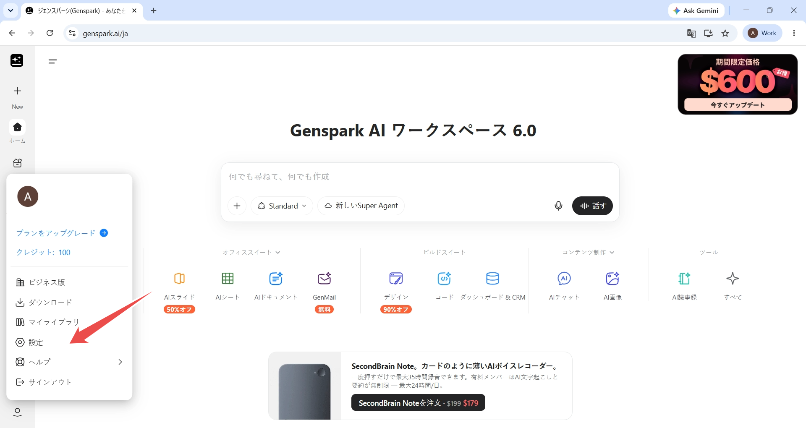
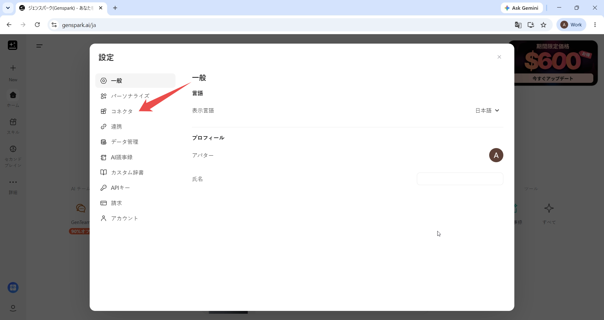
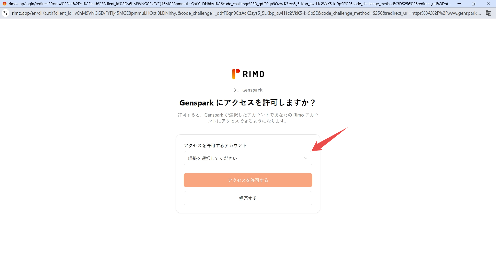
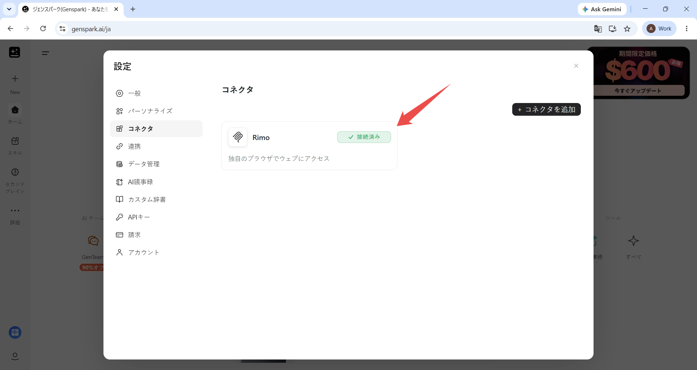
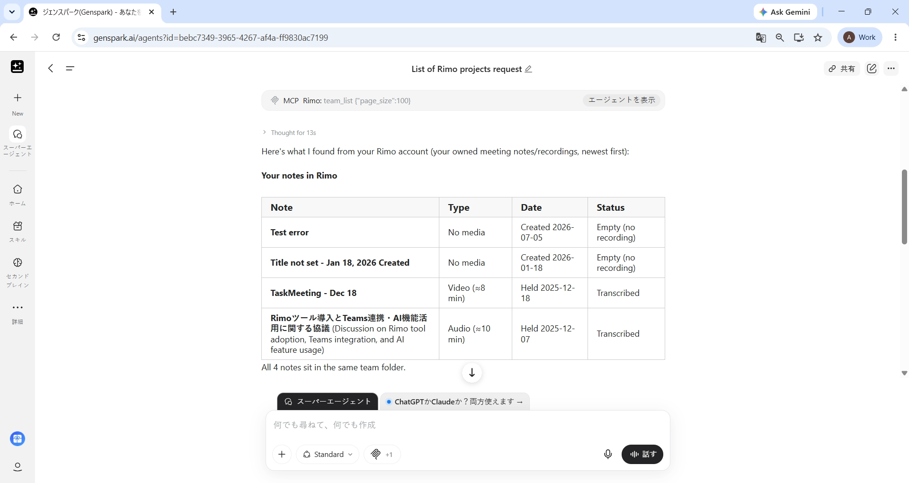

# Genspark で Rimo を使う

[English](../en/rimo-in-genspark.md) | [日本語](../ja/rimo-in-genspark.md)

Genspark を離れずに、ミーティングについて質問できます。Genspark に Rimo を **カスタムMCPサーバー** として一度追加し、自分の Rimo アカウントでサインインすれば、あとはふだんの言葉で聞くだけです — 「Rimo にある自分のプロジェクトを一覧して」のように尋ねると、Genspark がミーティングノートを調べて答えてくれます。

**追加するサーバー URL:**

```
https://mcp.rimo.app/mcp
```

> Claude、ChatGPT、Gemini、Notion、Microsoft Copilot をお使いですか? [Claude で Rimo を使う](rimo-in-claude.md)、[ChatGPT で Rimo を使う](rimo-in-chatgpt.md)、[Gemini で Rimo を使う](rimo-in-gemini.md)、[Notion で Rimo を使う](rimo-in-notion.md)、[Microsoft Copilot で Rimo を使う](rimo-in-microsoft.md) を参照してください。自分のマシンのコーディングツール（Claude Code、Cursor、Codex）の場合は [コーディングツールで使う](setup-guide.md) を参照してください。

---

## はじめる前に

- **Genspark アカウント** — [genspark.ai](https://www.genspark.ai) でサインインしているものです。インストールするものはありません。
- **Rimo アカウント** — いつもサインインしているものと同じもので、組織に所属しているものです。

> Rimo のパスワードやキーを Genspark に入力することはありません。サインインはブラウザで開く Rimo 自身のページで行います。

---

## Genspark に Rimo を追加する

### 1. Genspark の設定を開く

Genspark にサインインし、左サイドバー下部のアカウントメニューから **設定** を選びます。



### 2. コネクタを開く

設定のダイアログで、左側の一覧から **コネクタ** を選びます。



### 3. コネクタを追加する

**コネクタ** の画面で **コネクタを追加** を選びます。Genspark のコネクタ一覧が開きます。

### 4. Community & Custom を開く

一覧のカテゴリの下部にある **Community & Custom** を選び、**Add new MCP server** を選びます。


### 5. Rimo のサーバー情報を入力する

次のように入力し、**Add server** を選びます。

- **Server name:** `Rimo`
- **Server type:** **Streamable HTTP**
- **Server URL:** `https://mcp.rimo.app/mcp`
- **Description:** `Rimo — list, read, search, and ask across your meeting notes, transcripts, and documents.`

**Request headers** の欄は空のままにします。次の手順で Rimo にサインインするため、ここに入力するものはありません。


### 6. Rimo にサインインしてアクセスを許可する

ブラウザで Rimo の画面が開き、Genspark からのアクセスを許可するか尋ねられます。求められたらサインインし、**アクセスを許可するアカウント** で Genspark に使わせる Rimo の組織を選んで、**アクセスを許可する** を選びます。



### 7. 接続を確認する

Genspark に戻ると、**コネクタ** の画面に Rimo が **接続済み** のラベル付きで表示されます。



### 8. 最初の質問をする

**Super Agent** を開き、ふだんの言葉で質問します。接続できているかを確かめるには、一覧を尋ねるのが手軽です。

```
Give me a list of my projects at Rimo.
```

Genspark が Rimo を呼び出し、自分の Rimo アカウントで閲覧できるノートから回答します。



あとは、同僚に尋ねるようにミーティングについて聞いてみてください — [質問の例](#質問の例) を参照してください。

---

## 質問の例

「直近のミーティング」「先週のミーティング」「クライアントとのミーティング」のように、どのミーティングのことかを伝えて質問してください。

- 「Rimo にある自分のプロジェクトを一覧して。」
- 「直近の Rimo のミーティングについて教えて。」
- 「先週のミーティングで決まった重要なことは？」
- 「クライアントとのミーティングで出たアクションアイテムは？」
- 「そのミーティングには誰が出席した？」
- 「そのミーティングはどれくらいの時間だった？」
- 「Q3 のロードマップを議論したミーティングを探して。」
- 「製品ローンチについては何が決まった？」

見られるのは、**あなた自身が Rimo で見られる範囲だけ** です。また接続は読み取り専用なので、ノートの内容が変わることはありません。参照できる範囲の一覧は [MCP でできること](mcp.md) を参照してください。

---

## 補足

- **Super Agent で質問します。** Genspark が Rimo の接続を使うのはこの画面です。
- **質問に *Rimo* を入れてください** — 「Rimo のノート」「Rimo にある自分のプロジェクト」のように伝えると、ミーティングノートを参照してもらいやすくなります。
- **サーバーの種類は Streamable HTTP を選びます。** 入力画面にあるもう一方の **SSE (Deprecated)** は使いません。
- **一度に 1 つの Rimo 組織。** **アクセスを許可する** で選んだ組織が Genspark から見える範囲になります。別の組織を使うには、Rimo のコネクタを削除し、もう一度追加して、そのときに別の組織を選びます。

---

## Genspark 公式ヘルプ

- [Genspark Help Center](https://www.genspark.ai/helpcenter)
- [Connectors & Integrations](https://www.genspark.ai/helpcenter/connectors-and-integrations) — Genspark のコネクタ一覧についての公式ガイド

---

## 関連ページ

- [その他のツールで Rimo を使う](rimo-in-others.md) — Rimo が使えるその他のツール
- [MCP でできること](mcp.md) — 接続後に使えるツールと質問の例
- [Claude で Rimo を使う](rimo-in-claude.md) — Claude 向けの同じ手順
- [ChatGPT で Rimo を使う](rimo-in-chatgpt.md) — ChatGPT 向けの同じ手順
- [Gemini で Rimo を使う](rimo-in-gemini.md) — Gemini Spark 向けの同じ手順
- [Notion で Rimo を使う](rimo-in-notion.md) — Notion のカスタムエージェント向けの同じ手順
- [Microsoft Copilot で Rimo を使う](rimo-in-microsoft.md) — DCR で Copilot Studio エージェントに接続する
- [認証](authentication.md) — Rimo のサインインとアカウントの仕組み
