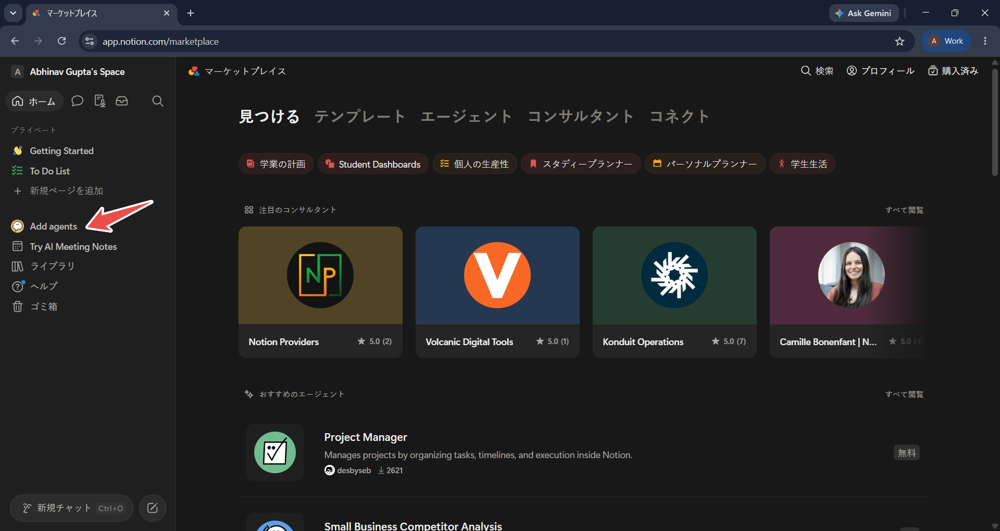
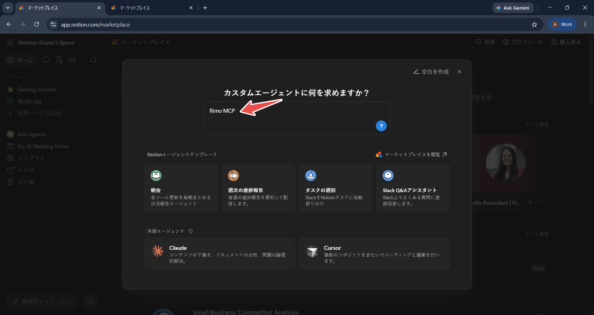
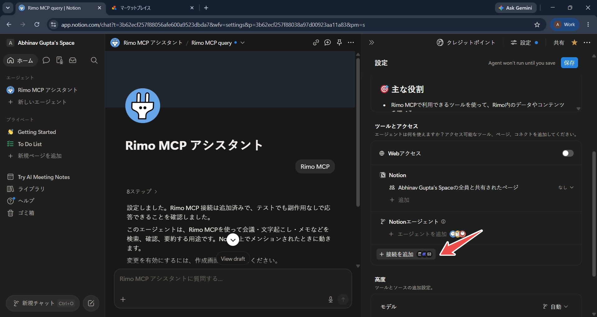
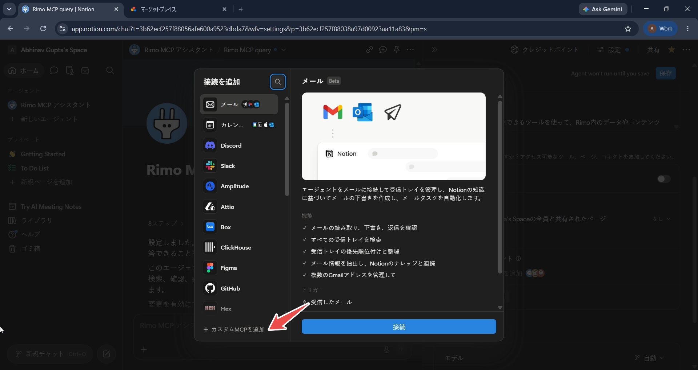
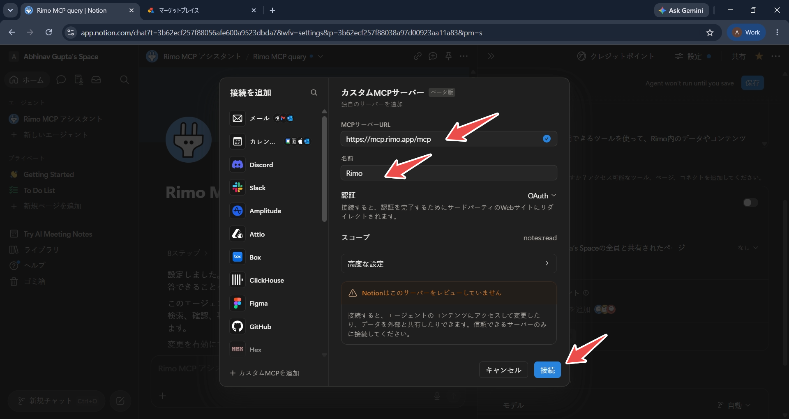
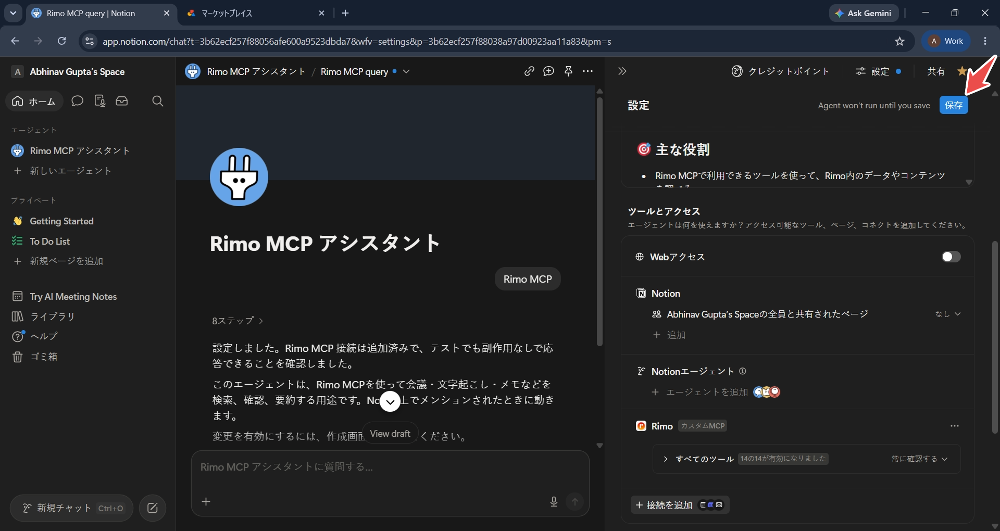
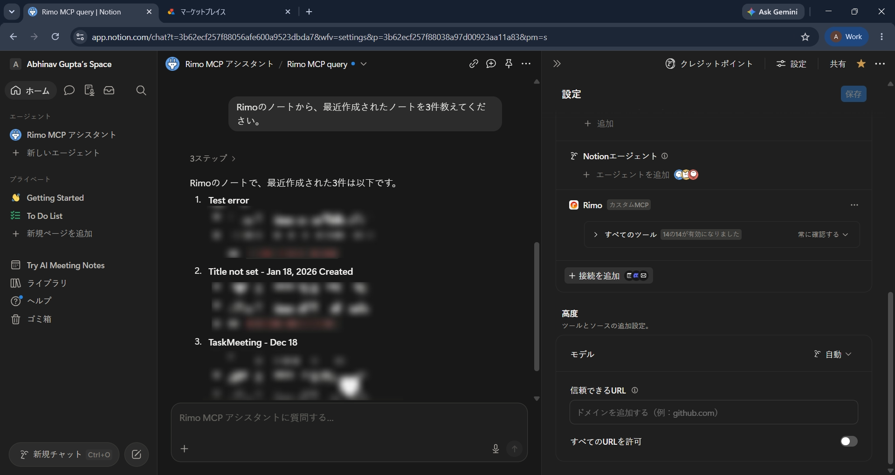

# Notion で Rimo を使う

[English](../en/rimo-in-notion.md) | [日本語](../ja/rimo-in-notion.md)

Notion を離れずに、ミーティングについて質問できます。Notion の **カスタムエージェント** に Rimo を **カスタムMCP** の接続として一度追加し、自分の Rimo アカウントでサインインすれば、あとはふだんの言葉で聞くだけです — 「価格については何が決まった?」のように尋ねると、エージェントがミーティングノートを調べて答えてくれます。

ミーティングで何が話されたか、何が決まったか、アクションアイテムは何か、誰が出席したか、いつ開催されどれくらいの時間だったか — 過去のミーティングを探すこともできます。[質問の例](#質問の例) を参照してください。

**追加するサーバー URL:**

```
https://mcp.rimo.app/mcp
```

> **Rimo が使えるのはカスタムエージェントの中だけです。** Notion の公式ドキュメントによると、MCP コネクションはカスタムエージェントでのみ利用でき、通常の Notion AI のチャットでは使えません。

> Claude、ChatGPT、Microsoft Copilot をお使いですか? [Claude で Rimo を使う](rimo-in-claude.md)、[ChatGPT で Rimo を使う](rimo-in-chatgpt.md)、[Microsoft Copilot で Rimo を使う](rimo-in-microsoft.md) を参照してください。自分のマシンのコーディングツール（Claude Code、Cursor、Codex）の場合は [コーディングツールで使う](setup-guide.md) を参照してください。

---

## はじめる前に

- MCP コネクションを利用できるプランの **Notion ワークスペース** — Notion の公式ドキュメントでは **ビジネス** と **エンタープライズ** で利用できると案内されています。
- **ワークスペースでカスタムMCPサーバーが有効になっていること。** 接続の一覧に **カスタムMCPを追加** が表示されない場合は、ワークスペースのオーナーまたは管理者による有効化が必要です。[Notion の MCP コネクションのガイド](https://www.notion.com/ja/help/mcp-connections-for-custom-agents) を参照してください。
- **Rimo アカウント** — いつもサインインしているものと同じもので、組織に所属しているものです。インストールするものはありません。

> Rimo のパスワードやキーを Notion に入力することはありません。サインインはブラウザで開く Rimo 自身のページで行います。

---

## カスタムエージェントに Rimo を追加する

### 1. カスタムエージェントを作成する

Notion のサイドバーで **Add agents** を選びます。



エージェントの用途（例: `Rimo MCP`）を入力して作成します。**空白を作成** を選ぶと説明を省略できます。



### 2. ツールとアクセスを開く

エージェントの **設定** を開き、**ツールとアクセス** で **接続を追加** を選びます。



### 3. カスタムMCPの接続を追加する

接続の一覧が開きます。その下部にある **カスタムMCPを追加** を選びます。



### 4. Rimo のサーバー情報を入力する

サーバーの情報を入力し、**接続** を選びます。

- **MCPサーバーURL:** `https://mcp.rimo.app/mcp`
- **名前:** `Rimo`
- **認証:** **OAuth**

画面には要求される **スコープ**（`notes:read`）と、「Notionはこのサーバーをレビューしていません」という注意が表示されます。Rimo は Notion がレビュー済みの連携ではなく、自分で追加するサーバーとして扱われるためです。



### 5. Rimo にサインインする

ブラウザで Rimo の画面が開き、Notion からのアクセスを許可するか尋ねられます。**Account to grant access** でエージェントに使わせる Rimo の組織を選び、**Allow access** を選びます。


### 6. エージェントを保存する

Notion に戻ると、**ツールとアクセス** に Rimo が **カスタムMCP** のラベル付きで表示されます。**保存** を選びます。保存するまでエージェントは動作しません。



### 7. 最初の質問をする

エージェントを開き、ふだんの言葉で質問します。接続できているかを確かめるには、一覧を尋ねるのが手軽です。

```
Rimoのノートから、最近作成されたノートを3件教えてください。
```

エージェントが Rimo を呼び出し、自分の Rimo アカウントで閲覧できるノートから回答します。



あとは、同僚に尋ねるようにミーティングについて聞いてみてください — [質問の例](#質問の例) を参照してください。

---

## 質問の例

コマンドを覚える必要はありません。「直近のミーティング」「先週のミーティング」「クライアントとのミーティング」のように、どのミーティングのことかを伝えて質問してください。

- 「直近のミーティングについて教えて。」
- 「先週のミーティングで決まった重要なことは？」
- 「クライアントとのミーティングで出たアクションアイテムは？」
- 「そのミーティングには誰が出席した？」
- 「そのミーティングはどれくらいの時間だった？」
- 「Q3 のロードマップを議論したミーティングを探して。」
- 「製品ローンチについては何が決まった？」

見られるのは、**あなた自身が Rimo で見られる範囲だけ** です。また接続は読み取り専用なので、ノートの内容が変わることはありません。参照できる範囲の一覧は [MCP でできること](mcp.md) を参照してください。

---

## 補足

- **カスタムエージェント専用です。** Notion の公式ドキュメントによると、MCP コネクションは通常の Notion AI のチャットでは使えません。
- **コネクションは 1 つのエージェントに紐づきます。** Notion の公式ドキュメントによると、各 MCP コネクションは単一のカスタムエージェント専用です。別のエージェントで使うには、そのエージェント用に追加し直します。
- **接続したら保存が必要です。** 保存するまでエージェントは動作しないと Notion 上で案内されます。
- **一度に 1 つの Rimo 組織。** **Allow access** で選んだ組織がエージェントから見える範囲になります。別の組織を使うには、**ツールとアクセス** で Rimo の接続を削除し、もう一度追加して、そのときに別の組織を選びます。
- **読み取り専用です。** 接続が要求するスコープは `notes:read` のみで、ノートの閲覧はできても変更はできません。詳しくは [MCP でできること](mcp.md) を参照してください。
- **カスタムMCP は Notion では「ベータ版」** と表示されます。

---

## Notion 公式ヘルプ

- [MCP connections for Notion Custom Agents](https://www.notion.com/ja/help/mcp-connections-for-custom-agents)
- [Connect Custom Agents to your tool stack with MCP integrations](https://www.notion.com/ja/help/guides/connect-custom-agents-to-mcp-integrations)
- [Security best practices for Agent connections](https://www.notion.com/ja/help/security-best-practices-for-agent-connections)

---

## 関連ページ

- [その他のツールで Rimo を使う](rimo-in-others.md) — Rimo が使えるその他のツール
- [MCP でできること](mcp.md) — 接続後に使えるツールと質問の例
- [Claude で Rimo を使う](rimo-in-claude.md) — Claude 向けの同じ手順
- [ChatGPT で Rimo を使う](rimo-in-chatgpt.md) — ChatGPT 向けの同じ手順
- [Microsoft Copilot で Rimo を使う](rimo-in-microsoft.md) — DCR で Copilot Studio エージェントに接続する
- [認証](authentication.md) — Rimo のサインインとアカウントの仕組み
